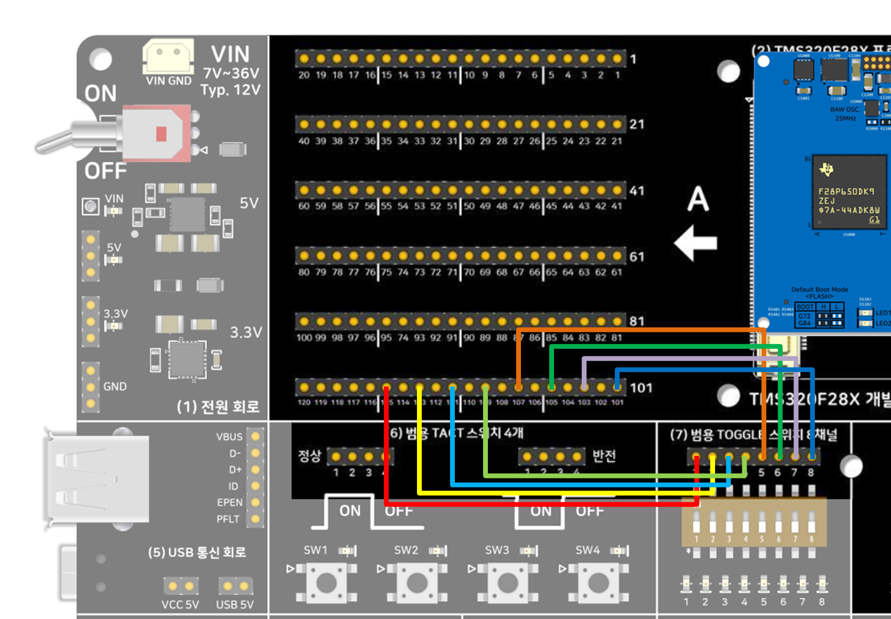

# 토글 스위치 8채널 테스트 — FreeRTOS 버전 — TMS320F28P659DK8-Q1

[7_GP_Toggle8_Driverlib](../7_GP_Toggle8_Driverlib/README.md)(DriverLib 버전)와 **GPIO 제어
코드는 완전히 동일**하게 두고, "메인 루프에서 직접 딜레이"를 "FreeRTOS 태스크 1개가
스케줄러 위에서 도는 방식"으로만 바꾼 버전입니다.

## 이 버전의 핵심
- **힙을 전혀 쓰지 않습니다.** `configSUPPORT_DYNAMIC_ALLOCATION=0`, 태스크는
  `xTaskCreateStatic()`으로 스택을 코드에 고정 배열로 선언합니다(heap_x.c 자체가
  프로젝트에 없습니다).
- 태스크는 스위치 태스크 1개 + FreeRTOS가 항상 만드는 Idle 태스크 1개, 소프트웨어
  타이머·큐는 안 씁니다.
- `DEVICE_DELAY_US` busy-wait 대신 `vTaskDelay(20 / portTICK_PERIOD_MS)`로 20msec마다
  CPU를 Idle 태스크에 양보합니다.

## 요구 하드웨어 / 배선
[7_GP_Toggle8_Driverlib](../7_GP_Toggle8_Driverlib/README.md)와 완전히 동일. **v1.10부터
스위치 번호와 GPIO 대응이 핀 순서와 반대입니다** — 점퍼선 꼬임 방지 목적:

| 스위치 | GPIO | A Side 핀 |
|---|---|---|
| 1번 | GPIO25 | 115번 |
| 2번 | GPIO24 | 113번 |
| 3번 | GPIO23 | 111번 |
| 4번 | GPIO22 | 109번 |
| 5번 | GPIO21 | 107번 |
| 6번 | GPIO20 | 105번 |
| 7번 | GPIO19 | 103번 |
| 8번 | GPIO18 | 101번 |

## 소프트웨어 버전
CCS 21.x / **SysConfig 미사용** / C2000Ware 26.00.00.00 driverlib(로컬 복사) / **FreeRTOS
커널 소스 전체를 `FreeRTOS/` 폴더에 로컬 복사** / CGT 22.6.3.LTS

## 동작 원리

토글 스위치가 "이벤트가 아니라 상태를 나타낸다"는 점, 실무에서는 보통 부팅 시
한 번만 읽어서 노드 주소/동작 모드 같은 설정값으로 쓴다는 점, 그리고 왜 이
경우엔 스위치 바운스가 문제되지 않는지는 DriverLib 버전과 완전히 동일합니다 —
자세한 설명은
[7_GP_Toggle8_Driverlib의 "동작 원리"](../7_GP_Toggle8_Driverlib/README.md#동작-원리)를
참고하세요.

이 버전에서 유일하게 다른 점은 그 폴링 로직이 **FreeRTOS 태스크 안에서** 돈다는
것뿐입니다. `ToggleSwitch_Task()`의 `for(;;)` 루프 내부(GPIO 읽기 →
`toggleSwitchState` 갱신)는 DriverLib 버전의 메인 루프와 한 글자도 다르지 않고,
다만 `DEVICE_DELAY_US(20000)`(그동안 CPU를 그냥 붙잡고 기다림) 대신
`vTaskDelay(20 / portTICK_PERIOD_MS)`(그동안 CPU를 Idle 태스크에게 넘겨줌)를
씁니다.

## Import → Build → Flash → Run
1. CCS에서 `CCS/7_GP_Toggle8_Freertos.projectspec`를 Import
2. Build (CPU1_RAM 또는 CPU1_FLASH) — FreeRTOS 전용 링커 cmd
   (`28p65x_freertos_*_lnk_cpu1.cmd`)를 사용합니다. `.freertosStaticStack` 섹션에
   태스크 스택이 배치됩니다.
3. Debug 연결 후 Flash/Run — `.ccxml`은 `TMS320F28P650DK9.ccxml` 사용 (DK8-Q1 최초 연결 시
   확인 필요, 7_GP_Toggle8_Driverlib와 동일한 주의사항)

## 정상 동작 확인
7_GP_Toggle8_Driverlib와 동일하게 스위치를 켜고 끄면 LED Indicator가 반응합니다. 딜레이가
`vTaskDelay()`(FreeRTOS 틱 기준, 1ms 틱)로 바뀌어서 폴링 주기가 DriverLib 버전의
`DEVICE_DELAY_US` busy-wait와 미세하게 다를 수 있습니다. `toggleSwitchState`/`pollCount`는
CCS Expressions에서 동일하게 확인 가능합니다.

## FreeRTOS에서 이 예제가 쓴 것만 정리

| 함수·매크로 | 하는 일 | 이 예제에서 |
|---|---|---|
| `xTaskCreateStatic(...)` | 태스크를 하나 만듭니다 | 힙(malloc) 대신 미리 준비해둔 배열(스택)과 구조체(TCB)를 그대로 씁니다 |
| `StaticTask_t` / `StackType_t[]` | 태스크에 필요한 메모리 두 조각 | TCB(제어블록)와 전용 스택 공간, 전역 배열로 선언 |
| `vTaskStartScheduler()` | 스케줄러를 시작합니다 | 이 줄 이후로는 `main()`으로 다시 안 돌아옵니다 |
| `vTaskDelay(ticks)` | 지금 태스크를 n틱 동안 재웁니다 | 그동안 CPU를 Idle 태스크에게 넘겨줍니다 |
| `vApplicationGetIdleTaskMemory(...)` | Idle 태스크가 쓸 메모리를 알려주는 콜백 | 정적 할당을 쓰기로 한 순간 구현이 강제됩니다 |
| `vApplicationStackOverflowHook(...)` | 스택 초과 시 호출되는 콜백 | `configCHECK_FOR_STACK_OVERFLOW=2`로 감시 켬 |
| `#pragma DATA_SECTION(...)` | (TI 컴파일러 지시어) | 배열을 `.freertosStaticStack` 섹션에 배치 — 링커 cmd가 그 섹션을 RAM에 미리 배정해둠 |

### `FreeRTOSConfig.h`에서 이 예제가 켠/끈 것
| 설정 | 값 | 의미 |
|---|---|---|
| `configSUPPORT_STATIC_ALLOCATION` | 1 | 정적 할당 API 사용 가능 |
| `configSUPPORT_DYNAMIC_ALLOCATION` | 0 | 힙 기반 API 사용 금지 |
| `configTICK_RATE_HZ` | 1000 | 1ms마다 한 번 스케줄러 판단(틱) |
| `configMAX_PRIORITIES` | 5 | 우선순위는 0~4 중 선택(이 예제는 0과 1만 씀) |
| `configCHECK_FOR_STACK_OVERFLOW` | 2 | 스택 오버플로우 감시 켬 |

## 세 가지 버전 비교
| 버전 | 폴더 | 핵심 차이 |
|---|---|---|
| DriverLib | [7_GP_Toggle8_Driverlib](../7_GP_Toggle8_Driverlib/) | TI 표준 HAL 함수 호출 |
| 비트필드 | [7_GP_Toggle8_Bitfield](../7_GP_Toggle8_Bitfield/) | 레지스터 구조체 직접 조작, DriverLib 미사용 |
| **FreeRTOS(이 폴더)** | 7_GP_Toggle8_Freertos | DriverLib + 태스크 스케줄링, 정적 할당 |

### 메모리 실측 비교 (2026-09-16, CCS 21.x, CPU1_RAM 빌드, `.map` 기준)

세 프로젝트 모두 `workspace_ccstheia`에서 실제로 Import → Build까지 성공한 뒤의 `.map`
파일 MODULE SUMMARY "Grand Total"(code/ro data/rw data) 기준 실측치입니다.

| 버전 | code | ro data | rw data | 합계 |
|---|---:|---:|---:|---:|
| **FreeRTOS(이 폴더)** | 5,139 B | 821 B | 1,239 B (RTS 스택 512B + 태스크 정적 스택 512B + 전역변수 215B) | **7,199 B** |
| DriverLib | 3,023 B | 604 B | 1,030 B (스택 1,016B) | **4,657 B** |
| 비트필드 | 3,778 B | 482 B | 1,685 B (스택 256B) | **5,945 B** |

FreeRTOS는 code/ro data 합계로는 세 버전 중 가장 크지만, 총합 기준으로는 클래식
비트필드 버전(rw data에 주변장치 레지스터 구조체 심볼이 잡혀서 부풀어 보이는 5,945B)과
큰 차이가 안 납니다. DriverLib 대비 순수 추가분(+2,542B)의 대부분은 태스크 데이터가
아니라 FreeRTOS 커널 코드(`tasks.c`/`list.c`/`queue.c`/`port.c` 등) 자체입니다 — 두
태스크(스위치+Idle)의 정적 스택(합쳐 512B)은 추가분의 5분의 1 수준입니다.

## 관련 링크
- 상품 페이지: https://tms320f28x.co.kr/goods/goods_view.php?goodsNo=200903127
- 게시판 글: (게시 후 URL 추가 예정)
- 유튜브 영상: (게시 후 URL 추가 예정)
